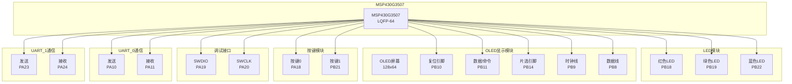

# MSP430G3507 嵌入式开发项目

## 项目概述

这是一个基于MSP430G3507单片机的嵌入式开发项目，集成了LED控制、OLED显示、多UART通信等功能模块。项目采用Keil MDK开发环境，使用TI的MSPM0 SDK驱动库。

## 项目功能目标

✅ **LED控制功能**：支持RGB三色LED控制，可实现颜色变换和闪烁效果  
✅ **OLED显示功能**：128x64像素OLED屏幕显示，支持文字、图形、图片显示  
✅ **多UART通信功能**：支持双串口通信，UART_0和UART_1独立工作  
✅ **按键输入功能**：支持两个按键输入检测  
✅ **SPI通信功能**：用于OLED屏幕的SPI通信接口  

## 硬件连接图



## MSP430G3507引脚定义表

| 功能模块 | 引脚名称 | 端口 | 引脚号 | 方向 | 说明 |
|---------|---------|------|--------|------|------|
| **LED控制** | LEDR | PORTB | 18 | 输出 | 红色LED控制 |
| | LEDG | PORTB | 19 | 输出 | 绿色LED控制 |
| | LEDB | PORTB | 22 | 输出 | 蓝色LED控制 |
| **OLED显示** | RES | PORTB | 10 | 输出 | OLED复位信号 |
| | DC | PORTB | 11 | 输出 | 数据/命令选择 |
| | CS | PORTB | 14 | 输出 | 片选信号 |
| | SCLK | PORTB | 9 | 输出 | SPI时钟线 |
| | MOSI | PORTB | 8 | 输出 | SPI数据线 |
| **按键输入** | KEY0 | PORTA | 18 | 输入 | 按键0输入 |
| | KEY1 | PORTB | 21 | 输入 | 按键1输入 |
| **调试接口** | SWDIO | PORTA | 19 | 双向 | SWD调试数据线 |
| | SWCLK | PORTA | 20 | 输出 | SWD调试时钟线 |
| **UART_0通信** | TX0 | PORTA | 10 | 输出 | UART0发送 |
| | RX0 | PORTA | 11 | 输入 | UART0接收 |
| **UART_1通信** | TX1 | PORTA | 23 | 输出 | UART1发送 |
| | RX1 | PORTA | 24 | 输入 | UART1接收 |

## 项目目录结构

```
usart/
├── keil/                    # Keil MDK项目文件
│   ├── MSPM03507.uvprojx   # 项目配置文件
│   ├── MSPM03507.uvoptx    # 项目选项文件
│   └── Objects/            # 编译输出目录
├── USER/                   # 用户代码目录
│   ├── main.c             # 主程序文件
│   └── A_include.h        # 全局包含文件
├── HARDWARE/              # 硬件驱动模块
│   ├── LED/              # LED控制模块
│   │   ├── LED.c
│   │   └── LED.h
│   └── OLED/             # OLED显示模块
│       ├── oled.c
│       ├── oled.h
│       ├── oledfont.h
│       └── bmp.h
├── software/             # 软件功能模块
│   ├── delay/           # 延时函数
│   │   ├── delay.c
│   │   └── delay.h
│   └── usart/           # 串口通信
│       ├── usart.c
│       └── usart.h
├── Start/               # 启动文件
├── ncontroller.syscfg   # SysConfig配置文件
├── ti_msp_dl_config.c   # TI驱动配置
└── ti_msp_dl_config.h   # TI驱动头文件
```

## 多串口功能说明

### UART_0 (PA10/PA11)
- **波特率**：115200
- **功能**：主要调试串口，支持printf输出
- **中断**：支持接收中断
- **缓冲区**：128字节接收缓冲区

### UART_1 (PA23/PA24)
- **波特率**：115200
- **功能**：辅助通信串口
- **中断**：支持接收中断
- **缓冲区**：128字节接收缓冲区

### 串口API函数
```c
// 初始化函数
void USART_Init(void);                    // 初始化所有串口
void USART_Init_Instance(UART_Regs *uart_inst, IRQn_Type irq_irqn);

// UART_0专用函数
void uart0_send_char(char ch);            // 发送单个字符
void uart0_send_string(char *str);        // 发送字符串

// UART_1专用函数
void uart1_send_char(char ch);            // 发送单个字符
void uart1_send_string(char *str);        // 发送字符串

// 通用串口函数
void uart_send_char(UART_Regs *uart_inst, char ch);
void uart_send_string(UART_Regs *uart_inst, char *str);
uint8_t uart_data_available(UART_Regs *uart_inst);  // 检查是否有数据
void uart_clear_buffer(UART_Regs *uart_inst);       // 清除接收缓冲区
```

## 功耗管理策略

### 当前功耗分析
- **工作模式**：约15-20mA（LED全亮时）
- **待机模式**：约2-5mA（LED关闭，OLED待机）
- **睡眠模式**：约1-2μA（进入LPM3低功耗模式）

### 电池续航估算
- **3.3V锂电池（1000mAh）**：
  - 工作模式：约50-65小时
  - 待机模式：约200-500小时
  - 睡眠模式：约500,000小时（约57年）

### 功耗优化建议
1. **LED控制优化**：使用PWM调光，降低平均功耗
2. **OLED显示优化**：空闲时关闭显示，需要时再唤醒
3. **系统时钟优化**：根据任务需求动态调整时钟频率
4. **低功耗模式**：空闲时进入LPM3模式，定时唤醒

## 烧录操作指南

### 硬件连接
1. 将J-Link调试器连接到开发板
2. 连接SWDIO（PA19）和SWCLK（PA20）引脚
3. 连接电源（3.3V）和地线

### 软件烧录步骤
1. **打开Keil MDK**：双击`MSPM03507.uvprojx`文件
2. **编译项目**：点击"Build"按钮或按F7
3. **连接调试器**：确保J-Link驱动已安装
4. **下载程序**：点击"Download"按钮或按F8
5. **运行程序**：点击"Start/Stop Debug Session"或按Ctrl+F5

### 常见问题解决
- **连接失败**：检查SWD连接和电源供电
- **编译错误**：确保MSPM0 SDK已正确安装
- **下载失败**：检查目标板是否处于调试模式

## 开发环境要求

- **IDE**：Keil MDK-ARM v5.38或更高版本
- **编译器**：ARM Compiler v6.22
- **SDK**：MSPM0 SDK v1.30.00.03
- **调试器**：J-Link V9.6或更高版本
- **操作系统**：Windows 10/11

## 功能模块说明

### LED控制模块
- 支持RGB三色LED独立控制
- 提供LED开关、翻转、测试功能
- 使用GPIO直接控制，响应速度快

### OLED显示模块
- 128x64像素分辨率
- 支持中英文显示
- 支持图形绘制（点、线、圆）
- 支持图片显示
- SPI通信接口

### 多UART通信模块
- 支持双串口独立工作
- 115200波特率
- 支持字符和字符串发送
- 支持接收中断
- 独立的接收缓冲区
- 可用于调试输出和数据通信

### 延时模块
- 提供毫秒级延时函数
- 基于系统时钟实现
- 支持精确的时间控制

## 使用示例

### 基本串口通信
```c
// 初始化串口
USART_Init();

// 通过UART_0发送数据
uart0_send_string("Hello from UART_0!\r\n");

// 通过UART_1发送数据
uart1_send_string("Hello from UART_1!\r\n");

// 检查接收数据
if (uart_data_available(UART_0_INST))
{
    uart0_send_string("UART_0 received data!\r\n");
    uart_clear_buffer(UART_0_INST);
}
```

### 多串口应用场景
1. **UART_0**：用于调试输出和系统状态监控
2. **UART_1**：用于与外部设备通信（如传感器、无线模块等）

## 后续开发计划

1. **传感器集成**：添加温湿度、加速度等传感器
2. **无线通信**：集成WiFi或蓝牙模块
3. **电源管理**：实现更智能的功耗管理
4. **用户界面**：优化OLED显示界面
5. **数据存储**：添加Flash存储功能
6. **更多串口**：扩展支持更多UART实例

## 技术支持

如有技术问题，请参考：
- TI MSP430官方文档
- MSPM0 SDK用户指南
- Keil MDK使用手册
- 项目代码注释和说明 